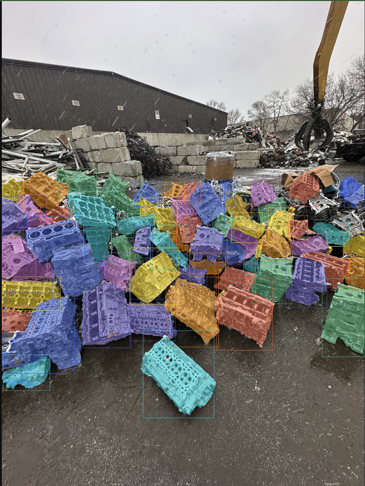
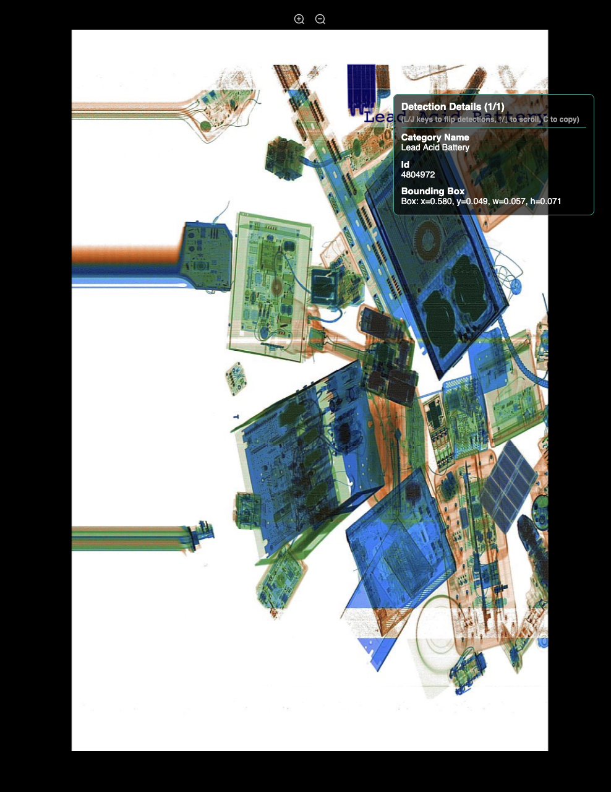
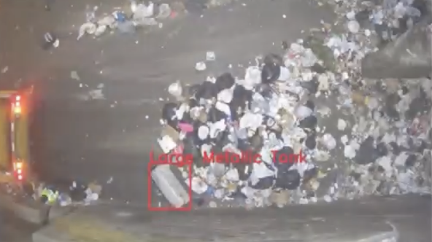
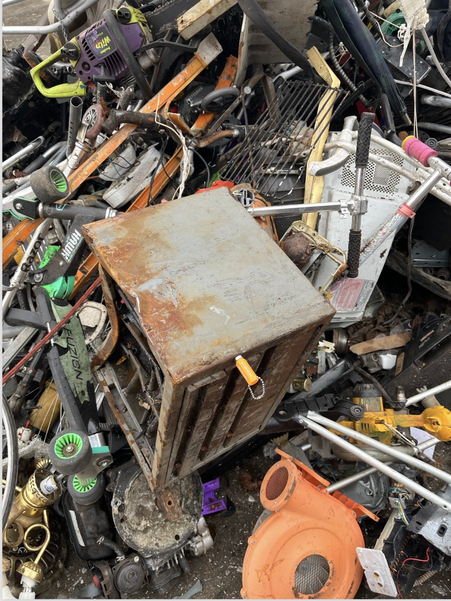
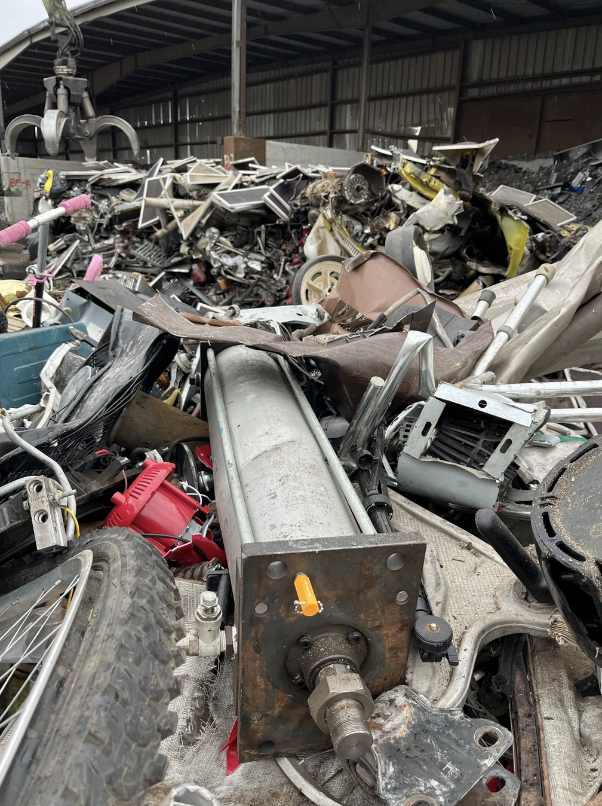

<div class="nav">
<span class="active">About Me</span>
<span>Visia</span>
<span>What we Do</span>
<span>Can we see yet</span>
<span>Metal Yard Application</span>
<span class="sub">1. Photos</span>
<span class="sub">2. Program Tools</span>
<span class="sub">3. Tech Stack</span>
<span class="sub">4. Context Management</span>
<span>GEPA Algorithm</span>
<span>Thank You</span>
</div>

## About Me


- Started as a Data Engineer
- A few years in a medical imaging start-up working on lung cancer detection in x-rays, and brain tumours in CT scans
- Approaching 4 years at Visia, building Computer Vision applications for recycling and heavy industry.

---

<div class="nav">
<span>About Me</span>
<span class="active">Visia</span>
<span>What we Do</span>
<span>Can we see yet</span>
<span>Metal Yard Application</span>
<span class="sub">1. Photos</span>
<span class="sub">2. Program Tools</span>
<span class="sub">3. Tech Stack</span>
<span class="sub">4. Context Management</span>
<span>GEPA Algorithm</span>
<span>Thank You</span>
</div>

## Visia

- Started off selling cameras to recycling facilities
- Chucked x-rays in for good measure (and preventing fires from Lithium Ion Batteries)
- Added Lidar into the mix for some applications
- Now **Multi-sensor AI for Heavy Industry**

---

<div class="nav">
<span>About Me</span>
<span>Visia</span>
<span class="active">What we Do</span>
<span>Can we see yet</span>
<span>Metal Yard Application</span>
<span class="sub">1. Photos</span>
<span class="sub">2. Program Tools</span>
<span class="sub">3. Tech Stack</span>
<span class="sub">4. Context Management</span>
<span>GEPA Algorithm</span>
<span>Thank You</span>
</div>

## What we Do



Help with cost disagreements between buyers and sellers at metal yards. 

---

<div class="nav">
<span>About Me</span>
<span>Visia</span>
<span class="active">What we Do</span>
<span>Can we see yet</span>
<span>Metal Yard Application</span>
<span class="sub">1. Photos</span>
<span class="sub">2. Program Tools</span>
<span class="sub">3. Tech Stack</span>
<span class="sub">4. Context Management</span>
<span>GEPA Algorithm</span>
<span>Thank You</span>
</div>

## What we Do



Find batteries in e-waste and municipals recycling with x-rays and lasers.

---

<div class="nav">
<span>About Me</span>
<span>Visia</span>
<span class="active">What we Do</span>
<span>Can we see yet</span>
<span>Metal Yard Application</span>
<span class="sub">1. Photos</span>
<span class="sub">2. Program Tools</span>
<span class="sub">3. Tech Stack</span>
<span class="sub">4. Context Management</span>
<span>GEPA Algorithm</span>
<span>Thank You</span>
</div>

## What we Do



Detect and send notifications for 'bulkies' in waste to energy facilities.

---

<div class="nav">
<span>About Me</span>
<span>Visia</span>
<span>What we Do</span>
<span class="active">Can we see yet</span>
<span>Metal Yard Application</span>
<span class="sub">1. Photos</span>
<span class="sub">2. Program Tools</span>
<span class="sub">3. Tech Stack</span>
<span class="sub">4. Context Management</span>
<span>GEPA Algorithm</span>
<span>Thank You</span>
</div>

## Can we see yet

<div style="font-size: 0.75em;">

- **Qwen 3.5** — best for object detection.
- **Gemini** — best for image-text descriptions / general image understanding. Gemini 3.1 pro
- **Sam3** - best for instance-segmentations and has some textual understanding (grounded phrases)
- **Moondream** - Some of all of the above and targeting smaller size ranges and higher inference speeds.

</div>

---

<div class="nav">
<span>About Me</span>
<span>Visia</span>
<span>What we Do</span>
<span>Can we see yet</span>
<span>Metal Yard Application</span>
<span class="sub active">1. Photos</span>
<span class="sub">2. Program Tools</span>
<span class="sub">3. Tech Stack</span>
<span class="sub">4. Context Management</span>
<span>GEPA Algorithm</span>
<span>Thank You</span>
</div>

## Metal Yard Application



---

<div class="nav">
<span>About Me</span>
<span>Visia</span>
<span>What we Do</span>
<span>Can we see yet</span>
<span>Metal Yard Application</span>
<span class="sub active">1. Photos</span>
<span class="sub">2. Program Tools</span>
<span class="sub">3. Tech Stack</span>
<span class="sub">4. Context Management</span>
<span>GEPA Algorithm</span>
<span>Thank You</span>
</div>

## Metal Yard Application



---

<div class="nav">
<span>About Me</span>
<span>Visia</span>
<span>What we Do</span>
<span>Can we see yet</span>
<span>Metal Yard Application</span>
<span class="sub active">1. Photos</span>
<span class="sub">2. Program Tools</span>
<span class="sub">3. Tech Stack</span>
<span class="sub">4. Context Management</span>
<span>GEPA Algorithm</span>
<span>Thank You</span>
</div>

## Metal Yard Application


---

<div class="nav">
<span>About Me</span>
<span>Visia</span>
<span>What we Do</span>
<span>Can we see yet</span>
<span>Metal Yard Application</span>
<span class="sub">1. Photos</span>
<span class="sub active">2. Program Tools</span>
<span class="sub">3. Tech Stack</span>
<span class="sub">4. Context Management</span>
<span>GEPA Algorithm</span>
<span>Thank You</span>
</div>

## Metal Yard Application — 2. Program Tools

- The agent can **zoom in** on an uncertain or dense region
- The agent has both an **image-level** and **object-level** store
- Some simple dumps only require image-level retrieval (all the same material), most are more complicated and have a huge mix of materials made of different materials
- It can use **SAM3** to check the area (and relative areas) of an object

---

<div class="nav">
<span>About Me</span>
<span>Visia</span>
<span>What we Do</span>
<span>Can we see yet</span>
<span>Metal Yard Application</span>
<span class="sub">1. Photos</span>
<span class="sub active">2. Program Tools</span>
<span class="sub">3. Tech Stack</span>
<span class="sub">4. Context Management</span>
<span>GEPA Algorithm</span>
<span>Thank You</span>
</div>

## Metal Yard Application — 2. Program Tools

- All in service of finding the right **material grade** and the **cost deduction** — the accuracy of these 2 outputs are the core metric we optimise via the DSPy GEPA loops
- A single ticket can be approx 10 images of the dump, the system runs over each independently, that all gets saved to the database, and then the combination is fed into a separate LLM call to come to a conclusion on the material code and any deductions
- The customer reviews the output, writes a comment with any feedback, this is fed to another VLM which converts it to our Annotation format.

---

<div class="nav">
<span>About Me</span>
<span>Visia</span>
<span>What we Do</span>
<span>Can we see yet</span>
<span>Metal Yard Application</span>
<span class="sub">1. Photos</span>
<span class="sub active">2. Program Tools</span>
<span class="sub">3. Tech Stack</span>
<span class="sub">4. Context Management</span>
<span>GEPA Algorithm</span>
<span>Thank You</span>
</div>

## Metal Yard Application — DSPy Signature

```python
class RadiusTicketMaterialCodeSignature(dspy.Signature):
    """Determine the overall material code for an entire
    ticket (load) from per-frame analyses.

    Material codes:
    - 290-100: Steel blocks with transmissions
    - 290-101: Aluminum/iron blocks with transmissions
    - 290-102: Aluminum blocks with transmissions
    - 290-103: Aluminum transmissions
    - 290-104: Aluminum blocks
    - 290-105: Irony aluminum low grade, 15-29% aluminum
    - 290-106: Irony aluminum mid grade, 30-49% aluminum
    - 290-107: Irony aluminum high grade, 50-74% aluminum
    - 290-108: Irony aluminum high grade, 75%+ aluminum
    - 290-109: Aluminum van trailer
    - 290-110: Aluminum refrigerated trailer

    IMPORTANT — Solar panels: Always classify solar panel
    loads as 290-105 or at most 290-106.
    """
```

---

<div class="nav">
<span>About Me</span>
<span>Visia</span>
<span>What we Do</span>
<span>Can we see yet</span>
<span>Metal Yard Application</span>
<span class="sub">1. Photos</span>
<span class="sub">2. Program Tools</span>
<span class="sub active">3. Tech Stack</span>
<span class="sub">4. Context Management</span>
<span>GEPA Algorithm</span>
<span>Thank You</span>
</div>

## Metal Yard Application — 3. Tech Stack

- **Turbopuffer** for the object memory and image memory
- **DINOv3** for the embeddings for the Object and Image memory
- **Gemini** to coordinate the system
- **Qwen3.5** for the initial boxes and when to zoom (recursive)
- **SAM3** for masks when needed

---

<div class="nav">
<span>About Me</span>
<span>Visia</span>
<span>What we Do</span>
<span>Can we see yet</span>
<span>Metal Yard Application</span>
<span class="sub">1. Photos</span>
<span class="sub">2. Program Tools</span>
<span class="sub">3. Tech Stack</span>
<span class="sub active">4. Context Management</span>
<span>GEPA Algorithm</span>
<span>Thank You</span>
</div>

## Metal Yard Application — 4. Context Management

- When optimising this program with GEPA, we can't actually keep the image within the context of the reflection LM, because it almost instantly exceeds the token limit
- GEPA keeps multiple instances of your dataset within the context of the reflection LLM, in order to work out how to optimise across them

---

<div class="nav">
<span>About Me</span>
<span>Visia</span>
<span>What we Do</span>
<span>Can we see yet</span>
<span>Metal Yard Application</span>
<span class="sub">1. Photos</span>
<span class="sub">2. Program Tools</span>
<span class="sub">3. Tech Stack</span>
<span class="sub">4. Context Management</span>
<span class="active">GEPA Algorithm</span>
<span>Thank You</span>
</div>

## GEPA Algorithm

GEPA's core algorithm iterates through three stages — **Executor**, **Reflector**, **Curator** — each with distinct context demands.

| Stage | Role | Context |
|-------|------|---------|
| **Executor** | Runs candidate program on a small training minibatch (`reflection_minibatch_size`, default 3 examples) | Captures full execution traces: reasoning chains, intermediate outputs, tool calls, error messages |
| **Reflector** | Feeds traces + evaluator feedback into a strong LLM (`reflection_lm`) | Diagnoses failure modes and identifies causal patterns |
| **Curator** | Proposes concrete instruction mutation based on the diagnosis | Transforms reflection into actionable prompt edits |

---

<div class="nav">
<span>About Me</span>
<span>Visia</span>
<span>What we Do</span>
<span>Can we see yet</span>
<span>Metal Yard Application</span>
<span class="sub">1. Photos</span>
<span class="sub">2. Program Tools</span>
<span class="sub">3. Tech Stack</span>
<span class="sub">4. Context Management</span>
<span>GEPA Algorithm</span>
<span class="active">Thank You</span>
</div>

## Thank You

Be kind to each other, AI's getting wild.

### We're Hiring

If this kind of work interests you, reach out.

<!-- Add a link at the end to the DSPy article: if you don't use DSPy, you build DSPy, and you should only build it if you first know and understand DSPy. -->

---

## GEPA Context Management

GEPA (Generalized Evolutionary Prompt Adaptation) manages context through:

- **Evaluation cache** — stores `(candidate, example)` results to avoid redundant inference
- **Reflective dataset** — captures execution traces for reflection-based prompt mutation
- **Pareto frontiers** — tracks best programs per validation example or objective (compressed historical context)
- **Batch sampling** — strategic minibatch selection balances coverage vs. cost
- **State persistence** — `GEPAState` serializes candidate evolution.
