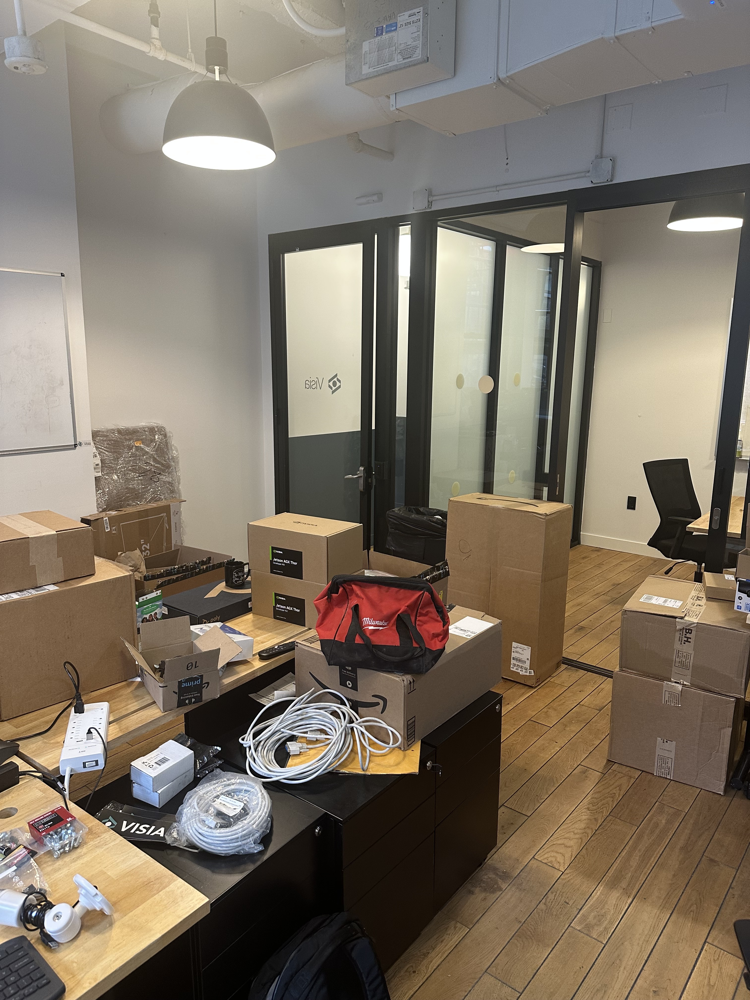

About Me
Visia
What we Do
Where do we use Agents
Metal Yard Application
1. Photos
2. Program Tools
3. Tech Stack
4. Context Management
GEPA Algorithm
GEPA Context
Context Pressure
Types of Context
Thank You

## About Me

- Started as a Data Engineer
- A few years in a medical imaging start-up working on lung cancer detection in x-rays, and brain tumours in CT scans
- Approaching 4 years at Visia, building Computer Vision applications for recyling and heavy industry.

---

About Me
Visia
What we Do
Where do we use Agents
Metal Yard Application
1. Photos
2. Program Tools
3. Tech Stack
4. Context Management
GEPA Algorithm
GEPA Context
Context Pressure
Types of Context
Thank You

## Visia

- **Multisensor AI for Heavy Industry** — cameras, x-rays, and lidar
- Started selling cameras to recycling facilities, added x-rays for detecting Lithium Ion Batteries (fire prevention), then lidar
- We help recyclers, metal yards, and waste-to-energy plants make faster, more accurate decisions
- ~30 people, based in Dublin with customers across Europe

---

About Me
Visia
What we Do
Where do we use Agents
Metal Yard Application
1. Photos
2. Program Tools
3. Tech Stack
4. Context Management
GEPA Algorithm
GEPA Context
Context Pressure
Types of Context
Thank You

## Visia

---

About Me
Visia
What we Do
Where do we use Agents
Metal Yard Application
1. Photos
2. Program Tools
3. Tech Stack
4. Context Management
GEPA Algorithm
GEPA Context
Context Pressure
Types of Context
Thank You

## What we Do

Help with cost disagreements between buyers and sellers at metal yards. 

---

About Me
Visia
What we Do
Where do we use Agents
Metal Yard Application
1. Photos
2. Program Tools
3. Tech Stack
4. Context Management
GEPA Algorithm
GEPA Context
Context Pressure
Types of Context
Thank You

## What we Do

Find batteries in e-waste and municipals recycling with x-rays and lasers.

---

About Me
Visia
What we Do
Where do we use Agents
Metal Yard Application
1. Photos
2. Program Tools
3. Tech Stack
4. Context Management
GEPA Algorithm
GEPA Context
Context Pressure
Types of Context
Thank You

## What we Do

Detect and send notifications for 'bulkies' in waste to energy facilities.

---

About Me
Visia
What we Do
Where do we use Agents
Metal Yard Application
1. Photos
2. Program Tools
3. Tech Stack
4. Context Management
GEPA Algorithm
GEPA Context
Context Pressure
Types of Context
Thank You

## Where do we use Agents

- **Billing disagreements in metal yards**
- **Active learning simulations**

---

About Me
Visia
What we Do
Where do we use Agents
Metal Yard Application
1. Photos
2. Program Tools
3. Tech Stack
4. Context Management
GEPA Algorithm
GEPA Context
Context Pressure
Types of Context
Thank You

## Metal Yard Application

<!-- TODO: Add photos of metal yard dumps -->

---

About Me
Visia
What we Do
Where do we use Agents
Metal Yard Application
1. Photos
2. Program Tools
3. Tech Stack
4. Context Management
GEPA Algorithm
GEPA Context
Context Pressure
Types of Context
Thank You

## Metal Yard Application — 2. Program Tools

- The agent can **zoom in** on an uncertain or dense region
- The agent has both an **image-level** and **object-level** store
- Some simple dumps only require image-level retrieval (all the same material), most are more complicated and have a huge mix of materials made of different materials
- It can use **SAM3** to get the area of an object
- All in service of finding the right **material grade** and the **cost deduction** — the accuracy of these 2 outputs are the core of the metric, with just a little bit of reward for accurate descriptions because we think it improves the product UX. The output can be fed back into the start of the program

---

About Me
Visia
What we Do
Where do we use Agents
Metal Yard Application
1. Photos
2. Program Tools
3. Tech Stack
4. Context Management
GEPA Algorithm
GEPA Context
Context Pressure
Types of Context
Thank You

## Metal Yard Application — 3. Tech Stack

- **Turbopuffer** for the object memory and image memory
- **DINOv3** for the embeddings
- **Gemini** to coordinate the system
- **Qwen3.5** for the initial boxes and when to zoom
- **SAM3** for masks when needed

---

About Me
Visia
What we Do
Where do we use Agents
Metal Yard Application
1. Photos
2. Program Tools
3. Tech Stack
4. Context Management
Types of Context
GEPA Algorithm
GEPA Context
Context Pressure
Thank You

## Metal Yard Application — 4. Context Management

- When optimising this program with GEPA, we can't actually keep the image within the context of the reflection LM, because it almost instantly exceeds the token limit
- GEPA keeps multiple instances of your dataset within the context of the reflection LLM, in order to work out how to optimise across them

---

About Me
Visia
What we Do
Where do we use Agents
Metal Yard Application
1. Photos
2. Program Tools
3. Tech Stack
4. Context Management
GEPA Algorithm
GEPA Context
Context Pressure
Types of Context
Thank You

## GEPA Algorithm

GEPA's core algorithm iterates through three stages — **Executor**, **Reflector**, **Curator** — each with distinct context demands.

| Stage | Role | Context |
|-------|------|---------|
| **Executor** | Runs candidate program on a small training minibatch (`reflection_minibatch_size`, default 3 examples) | Captures full execution traces: reasoning chains, intermediate outputs, tool calls, error messages |
| **Reflector** | Feeds traces + evaluator feedback into a strong LLM (`reflection_lm`) | Diagnoses failure modes and identifies causal patterns |
| **Curator** | Proposes concrete instruction mutation based on the diagnosis | Transforms reflection into actionable prompt edits |

---

About Me
Visia
What we Do
Where do we use Agents
Metal Yard Application
1. Photos
2. Program Tools
3. Tech Stack
4. Context Management
GEPA Algorithm
GEPA Context
Context Pressure
Types of Context
Thank You

## GEPA Context Management

GEPA (Generalized Evolutionary Prompt Adaptation) manages context through:

- **Evaluation cache** — stores `(candidate, example)` results to avoid redundant inference
- **Reflective dataset** — captures execution traces for reflection-based prompt mutation
- **Pareto frontiers** — tracks best programs per validation example or objective (compressed historical context)
- **Batch sampling** — strategic minibatch selection balances coverage vs. cost
- **State persistence** — `GEPAState` serializes candidate evolution.

---

About Me
Visia
What we Do
Where do we use Agents
Metal Yard Application
1. Photos
2. Program Tools
3. Tech Stack
4. Context Management
GEPA Algorithm
GEPA Context
Context Pressure
Types of Context
Thank You

## Handling Context Pressure

Practical mitigations for the double-pressure problem:

- **Reduce `reflection_minibatch_size`** from 3 to 1–2 for ReAct programs with long trajectories
- **Use a high-context reflection LM** — models with large context windows (10M tokens ideal)
- **Reduce ReAct's `max_iters`** to 3–5 instead of 20
- **Keep tool return values concise** — control retrieved passage counts and output verbosity
- **Override `truncate_trajectory()`** for domain-aware truncation that preserves the most informative steps, not just the most recent

---

About Me
Visia
What we Do
Where do we use Agents
Metal Yard Application
1. Photos
2. Program Tools
3. Tech Stack
4. Context Management
GEPA Algorithm
GEPA Context
Context Pressure
Types of Context
Thank You

## Types of Context

- **Prompt context** — system instructions and framing baked into the initial call
- **Retrieved context (RAG)** — information pulled from external stores at query time
- **Conversational context** — the history of the current interaction
- **Tool/observation context** — results from tool calls and API responses the agent generates for itself
- **Persistent context** — memories and session state carried across conversations (the cookies of agents, but more like a cheatsheet intentionally kept small)

<!-- The core tension: context management is compression and selection. Finite window, right information, right time. Too little → hallucination. Too much → noise. -->

---

About Me
Visia
What we Do
Where do we use Agents
Metal Yard Application
1. Photos
2. Program Tools
3. Tech Stack
4. Context Management
GEPA Algorithm
GEPA Context
Context Pressure
Types of Context
Thank You

## Thank You

Be kind to each other, AI's getting wild.

### We're Hiring

If this kind of work interests you, reach out.

<!-- Add a link at the end to the DSPy article: if you don't use DSPy, you build DSPy, and you should only build it if you first know and understand DSPy. -->
